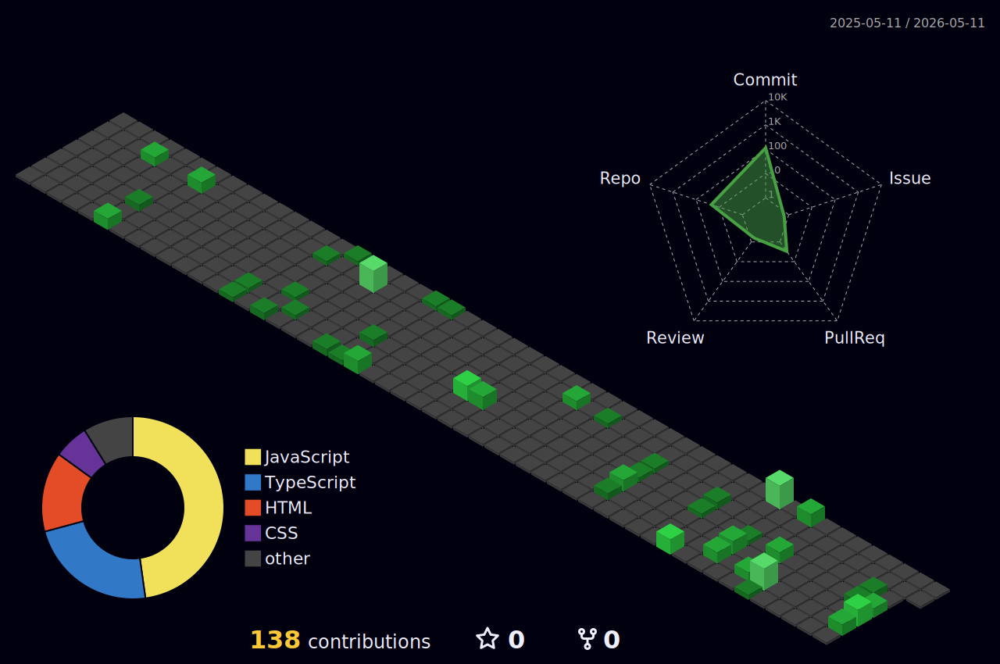

### Hi there, I am Dharmendra Vishvkarma 👋

  
 
💻 **Full Stack Developer** focused on building scalable web applications.  
🔭 Skilled in **MERN Stack + DSA**, with strong foundations in **System Design & Backend Architecture**.  
⚡ I care about **clean code, performance, and real-world problem solving**.  
🤝 Open to internships, freelance work, and collaboration.  
🎯 [GitHub Profile](https://github.com/dharmendra4522)

 

## 🚀 What Drives Me  
- Delivering **clean, scalable, maintainable code**  
- **Problem-solving** through technology  
- Continuous learning & adoption of new tools and frameworks  

 

## 🧠 Life in a Dev Loop  
`Think ➡️ Build ➡️ Break ➡️ Fix ➡️ Scale ➡️ Repeat`  

- Write code that actually survives production 🛠️  
- Debug faster than others complain 🐞  
- Learn what matters, ignore hype 📚  

 

## ✨ Closing Note  
> _“Most developers write code. Few build systems. Aim for the second.”_  

 

# 🛠Tech Stack

# 📊 GitHub Stats

  

### See My GitHub Snake in Action! 🎬🐍

### My Digital Trophy Shelf 🏆💻

  
  

## 📈 3D Contribution Graph

This immersive 3D visualization represents my GitHub contribution history, showcasing activity patterns in an interactive three-dimensional format.
